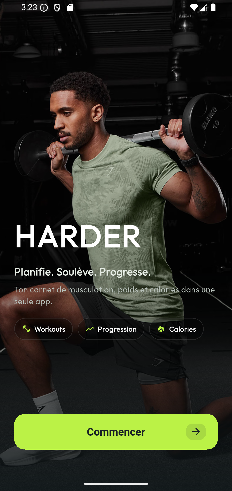
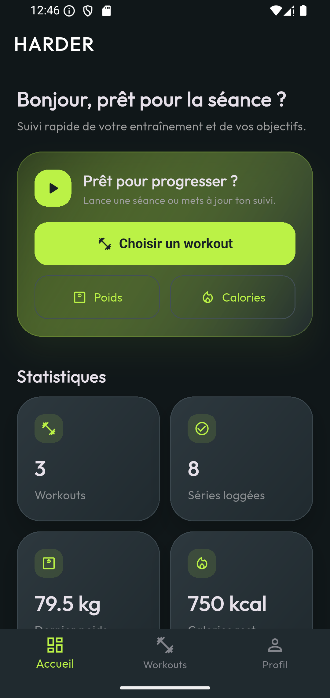
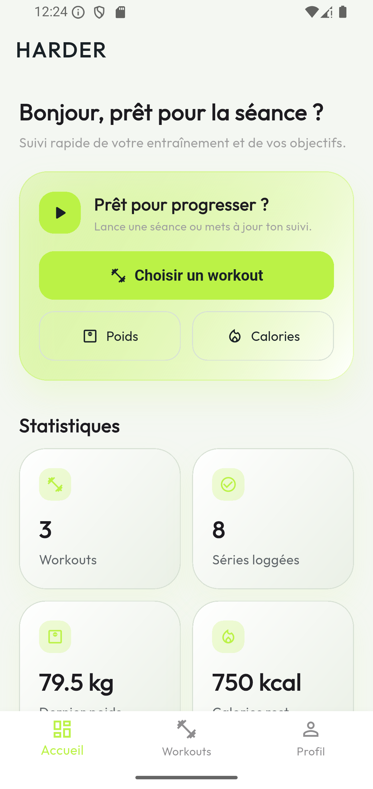
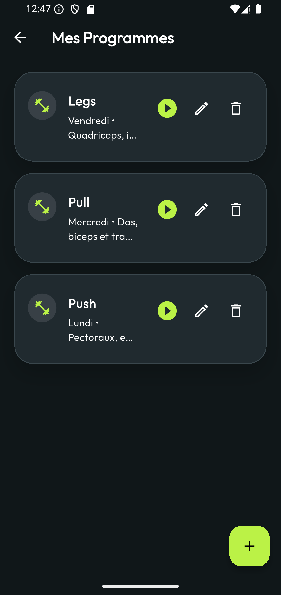
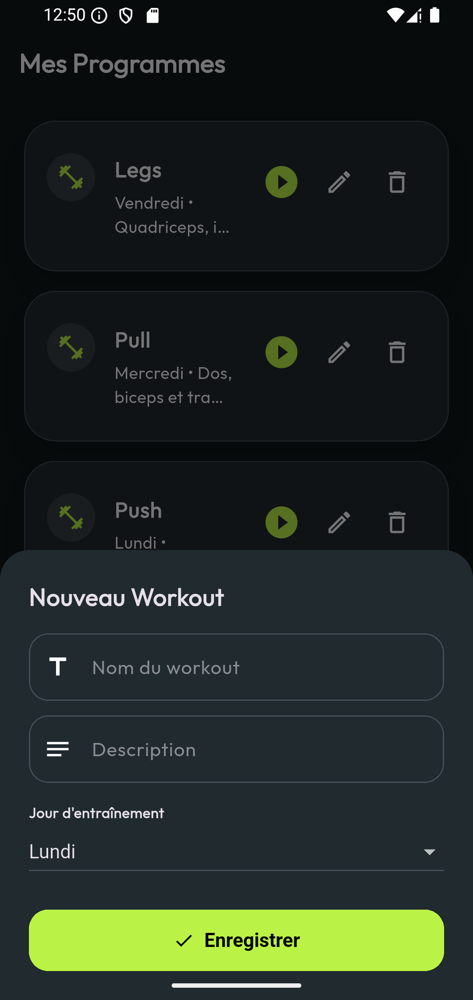
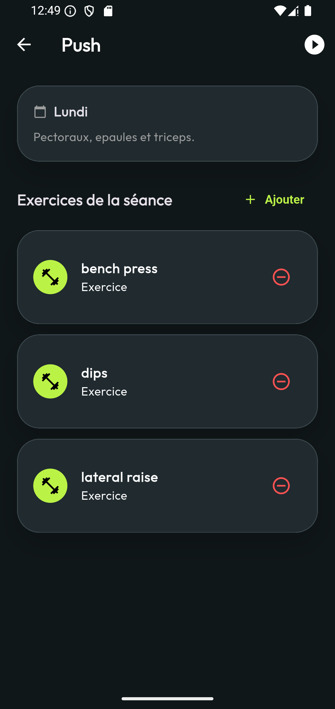
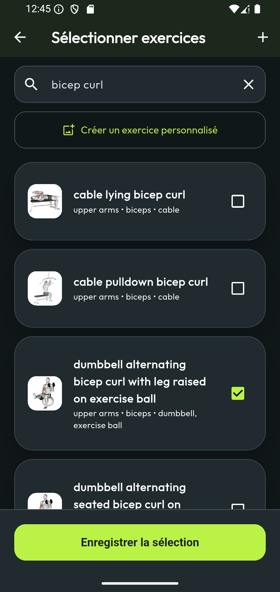
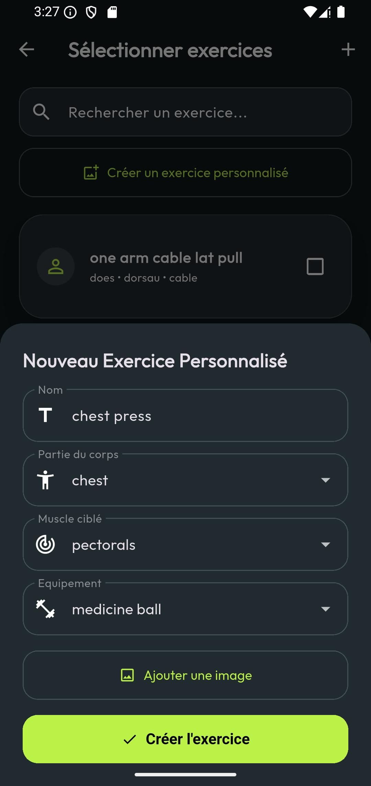
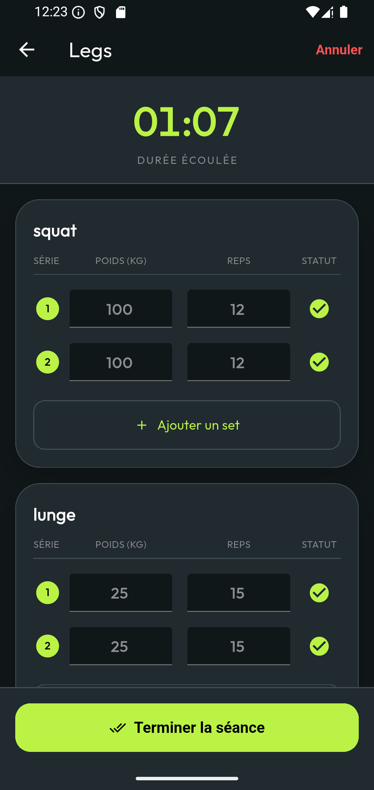
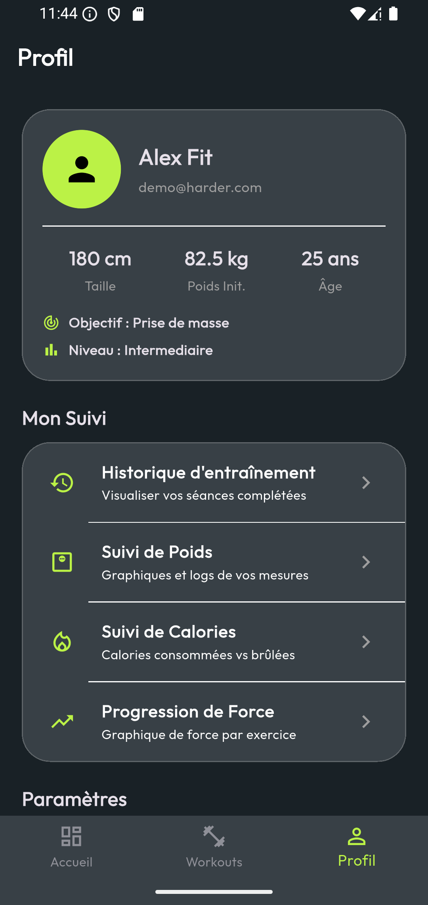

# HARDER - Application Mobile Fitness Tracker

HARDER est une application mobile Flutter de suivi fitness inspiree de Strong et Hevy. Elle permet de gerer des programmes d'entrainement, creer des exercices personnalises, lancer une seance, enregistrer les series avec poids/repetitions, suivre le poids corporel, suivre les calories et consulter l'historique sportif.

Le projet respecte les contraintes du mini-projet Flutter : architecture MVC, authentification, navigation entre plusieurs ecrans, CRUD, formulaires avec validation, stockage local SQLite, consommation d'une API REST et interface responsive avec theme personnalise.

## Fonctionnalites principales

- Authentification : inscription, connexion, deconnexion.
- Compte demo seed : `demo@harder.com` / `1234`.
- Landing page avec image de marque.
- Tableau de bord avec statistiques principales et raccourcis d'action.
- Gestion des workouts : creation, modification, suppression et consultation.
- Association d'exercices a un workout.
- Recherche d'exercices depuis ExerciseDB API.
- Creation d'exercices personnalises avec image locale.
- Lancement d'une seance active avec chronometre.
- Enregistrement des series : poids, repetitions, numero de serie.
- Resume de seance avec volume total.
- Historique d'entrainement.
- Suivi du poids corporel avec graphique.
- Suivi des calories consommees, brulees et objectif journalier.
- Progression de force par exercice.
- Theme sombre / clair.

## Technologies utilisees

- Flutter
- Dart
- SQLite avec `sqflite`
- API REST avec `http`
- ExerciseDB via RapidAPI
- `image_picker` pour choisir une image d'exercice personnalise
- `fl_chart` pour les graphiques
- `google_fonts` pour la typographie

## Architecture MVC adoptee

Le projet est organise selon l'architecture MVC.

### Model

Les modeles representent les donnees de l'application.

Exemples :

- `UserModel`
- `UserProfileModel`
- `WorkoutModel`
- `ExerciseModel`
- `SetLogModel`
- `WorkoutSessionModel`
- `BodyWeightModel`
- `CalorieEntryModel`

### View

Les vues contiennent les ecrans Flutter et les composants visuels.

Exemples :

- `LandingScreen`
- `LoginScreen`
- `DashboardScreen`
- `WorkoutListScreen`
- `WorkoutDetailsScreen`
- `AddExercisesScreen`
- `ActiveSessionScreen`
- `HistoryScreen`
- `BodyWeightScreen`
- `CaloriesScreen`
- `ProfileScreen`

### Controller

Les controleurs servent d'intermediaires entre les vues et les services.

Exemples :

- `AuthController`
- `WorkoutController`
- `ExerciseController`
- `SessionController`
- `BodyWeightController`
- `CaloriesController`
- `ProfileController`

### Service

Les services gerent l'acces aux donnees locales et externes.

- `DatabaseService` : creation et ouverture de la base SQLite.
- `SeedService` : creation du compte demo et des donnees initiales.
- `AuthService` : gestion des utilisateurs.
- `WorkoutService` : CRUD des workouts.
- `ExerciseService` : API ExerciseDB et exercices personnalises.
- `SessionService` : logs de series et seances.
- `BodyWeightService` : mesures de poids.
- `CaloriesService` : suivi calorique.

## Structure du projet

```txt
lib/
  controllers/
  models/
  services/
  utils/
  views/
    auth/
    body/
    calories/
    exercises/
    history/
    home/
    onboarding/
    profile/
    session/
    workouts/
  widgets/

assets/
  landing.png
```

## Base de donnees locale

L'application utilise SQLite pour stocker les donnees personnelles de l'utilisateur.

Tables principales :

- `users`
- `user_profiles`
- `workouts`
- `custom_exercises`
- `set_logs`
- `workout_sessions`
- `body_weights`
- `calorie_entries`

Les donnees sportives sont liees a l'utilisateur avec `userId`, afin d'eviter le melange des donnees entre plusieurs comptes.

## API externe

L'application utilise ExerciseDB API via RapidAPI pour recuperer les exercices.

Endpoints utilises :

- `GET /exercises`
- `GET /exercises/name/{query}`
- `GET /image?exerciseId={id}&resolution=180`

Les exercices personnalises restent locaux et sont stockes dans SQLite. Les images choisies depuis la galerie sont sauvegardees sous forme de chemin local (`imagePath`).

## Captures d'ecran principales

Les captures principales sont placees dans le dossier `screenshots/` a la racine du projet. GitHub affiche les images avec des chemins relatifs au depot, pas avec des chemins locaux Windows.

```txt
screenshots/
  landing_screen.png
  acceuil_dark.png
  acceuil_dark_2.png
  Acceuil_light.png
  workout_list.png
  create_workout.png
  one_workout.png
  search.png
  personalized_exercice.png
  in_workout.png
  profil.png
```

| Landing | Accueil sombre | Accueil clair |
| --- | --- | --- |
|  |  |  |

| Workouts | Creation workout | Details workout |
| --- | --- | --- |
|  |  |  |

| Recherche | Exercice personnalise | Seance |
| --- | --- | --- |
|  |  |  |

| Profil |
| --- |
|  |

## Installation

### Prerequis

- Flutter installe
- Android Studio installe
- Un emulateur Android ou un telephone Android avec USB debugging

Verifier l'installation Flutter :

```bash
flutter doctor
```

### Recuperer les dependances

Depuis la racine du projet :

```bash
flutter pub get
```

### Verifier le code

```bash
flutter analyze
flutter test
```

### Lancer l'application

```bash
flutter run
```

Ou depuis Android Studio :

1. Ouvrir le dossier du projet.
2. Cliquer sur `Pub get` si Android Studio le propose.
3. Selectionner un emulateur ou un telephone.
4. Ouvrir `lib/main.dart`.
5. Cliquer sur le bouton vert `Run`.

## Compte demo

Un compte demo est cree automatiquement par `SeedService`.

```txt
Email    : demo@harder.com
Password : 1234
```

Si les anciennes donnees SQLite restent affichees apres une modification de schema, desinstaller l'application depuis l'emulateur puis relancer le projet.

## Build APK debug

```bash
flutter build apk --debug
```

L'APK sera genere dans :

```txt
build/app/outputs/flutter-apk/app-debug.apk
```

## Remarque de securite

La cle RapidAPI est utilisee pour connecter ExerciseDB pendant le mini-projet. Pour un depot public, il est preferable de ne pas exposer la cle directement dans le code source et d'utiliser une configuration separee.
